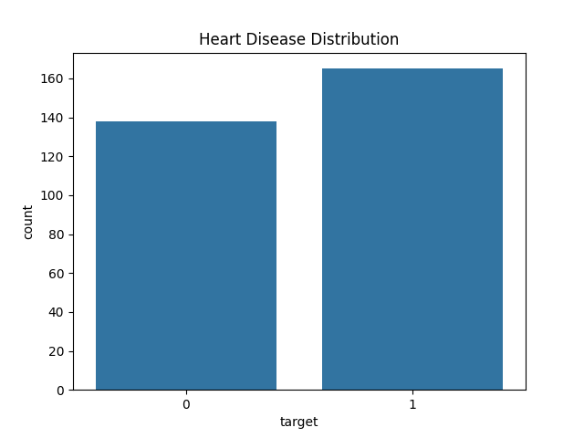
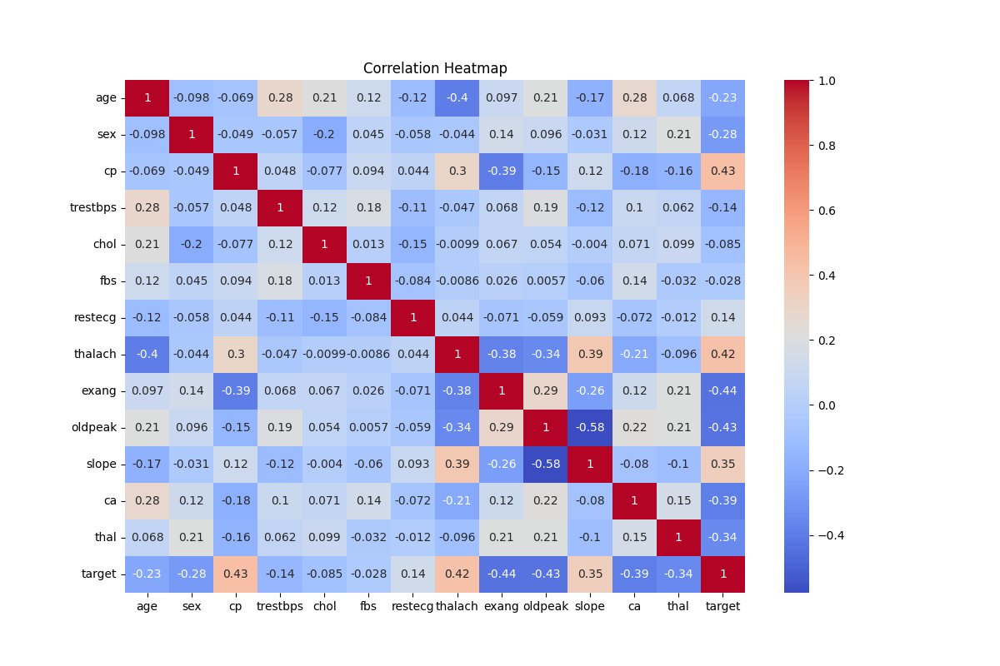
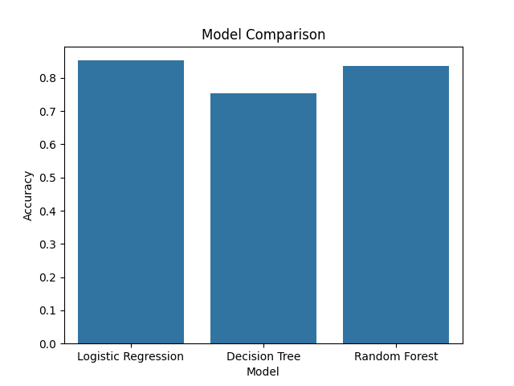
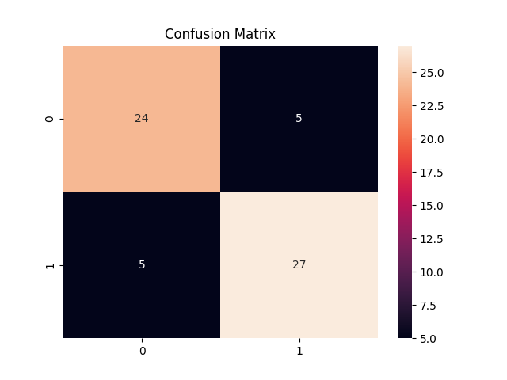

# Heart Disease Prediction Using Machine Learning

## Project Overview

This project predicts the likelihood of heart disease using Machine Learning algorithms. The workflow includes data preprocessing, exploratory data analysis (EDA), feature scaling, model training, evaluation, and comparison of multiple classification models.

## Dataset

The dataset contains patient health information including:

- Age
- Sex
- Chest Pain Type
- Resting Blood Pressure
- Cholesterol
- Fasting Blood Sugar
- Maximum Heart Rate
- Exercise Induced Angina
- ST Depression
- Number of Major Vessels
- Thalassemia
- Target (Heart Disease Presence)

Dataset Size:
- 303 Records
- 14 Features

## Project Workflow

### 1. Data Loading
- Import dataset using Pandas
- Inspect dataset structure

### 2. Exploratory Data Analysis (EDA)
- Target Distribution
- Age Distribution
- Gender Distribution
- Correlation Heatmap

### 3. Data Preprocessing
- Feature Selection
- Train-Test Split
- Feature Scaling using StandardScaler

### 4. Machine Learning Models

The following models were trained and evaluated:

1. Logistic Regression
2. Decision Tree Classifier
3. Random Forest Classifier

### 5. Model Evaluation

Evaluation metrics:

- Accuracy Score
- Confusion Matrix
- Classification Report

## Results

| Model | Accuracy |
|---------|---------|
| Logistic Regression | XX% |
| Decision Tree | XX% |
| Random Forest | XX% |

Random Forest achieved the highest accuracy among the tested models.

## Visualizations

### Target Distribution

### Correlation Heatmap

### Model Comparison

### Confusion Matrix

## Technologies Used

- Python
- NumPy
- Pandas
- Matplotlib
- Seaborn
- Scikit-Learn
- Jupyter Notebook

## Future Improvements

- Hyperparameter Tuning
- Cross Validation
- XGBoost Implementation
- Model Deployment using Flask/FastAPI
- Streamlit Dashboard

## Author

Hamza Ali Malik
